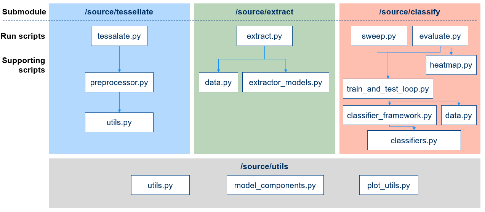

# pathology_classification
- [Overview](#overview)
  - [Repository structure](#repository-structure)
- [Usage](#usage)
  - [Installation](#installation)
  - [What you need to supply](#what-you-need-to-supply)
  - [Step 1: Tessellate](#step-1-tessellate)
  - [Step 2: Extract features](#step-2-extract-features)
  - [Step 3: Hyperparameter sweep](#step-3-hyperparameter-sweep)
  - [Step 4: Evaluate](#step-4-evaluate)
- [Contributing](#contributing)

## Overview
Binary whole-slide image classification based on preextracted features.

This repository provides tools to tessalate whole-slide images, extract features using pretrained models and to train a classifier based on these preextracted features. Its functionality is divided into three steps:
1. Tessalate: take a whole-slide image and split it into a square, non-overlapping patches.
2. Extract: summarize these patches into a feature vector using a pretrained feature extractor.
3. Hyperparameter sweep: explore configurations of hyperparameters to find optimal settings for the final classifier.
4. Evaluate: train and evaluate a final classifier to make binary classifications based on the preextracted features.

The user needs to supply a dataset of whole-slide images, a manifest csv-file containing the path to the slides and corresponding labels, and a configuration file containing the paths to the manifest file and desired output directory.

### Repository structure


## Usage
### Installation
Step 1: Install OpenSlide using the instructions in the [documentation](https://openslide.org/api/python/#installing). 

Step 2: Follow the instructions on the [Weights & Biases website](https://docs.wandb.ai/quickstart) to sign up for an account and setup the API token on your system. 

Step 3: Clone this repository:
```
git clone https://github.com/RensterMaat/pathology_classification.git
cd pathology_classification
```

Step 4: Create a fresh conda environment with Python and R.
```
conda create -n pathology_classification python r-base
```

Step 5: Install this repository using pip:
```
pip install . 
```

### What you need to supply
Create a manifest csv-file containing at least the columns "slide_id" and "slide_path". The slide_id column should contain a unique identifier for every whole-slide image. The slide_path column should be the absolute path to the corresponding slide. In addition, you can supply as many columns with data about these slides as desired. 
```
slide_id, slide_path, binary_label_1, binary_label_2, characteristic_1
example_1, /path/to/example_1.ndpi, 1, 0, lymph_node
...
```

Create a yaml-file in the config directory. Fill in the "manifest_file_path" field (the absolute path to the manifest you have created in the previous step) and the "output_dir" field (the path to the directory where the output of the pipeline should be stored). 
```
cd config/general
touch my_settings.yaml
nano my_settings.yaml
```

### Step 1: Tessellate
In this step, whole-slide images are preprocessed into square, non-overlapping patches of a fixed size. These images are saved to disk for faster processing during step 2. 

The most important parameters during this step are the extraction level and patch size. The extraction level is the level of magnification at which the patches are extracted, following the OpenSlide API. This means that level 0 is the highest level of magnification (e.g. 40x), level 1 is the next lowest (e.g. 20x) etc. The patch size is the size of the image that is extracted at the specified level of magnification. 

The /source/tessellate/tessellate.py script performs the preprocessing for all required magnification levels and patch sizes in one run. Different extractor models require different patch sizes (e.g. the ResNet50 extractor requires patches of 256x256). The magnification level can be set arbitrarily, except in the case when a feature extractor model (used in step 2) is pretrained on a specific magnification level (e.g., HIPT is pretrained on 20x). In the "extractor_models" section of the config file, the used extractor models are specified along with their required patch sizes and levels of magnification. 

To run this step, use the following command:
```
python source/tessellate/tessellate.py --config config/my_settings.yaml
```

In the supplied output directory, this will create the following directories and subdirectories: 
- tiles
  - extraction_level=1_patch_dimensions=[256,256]
    - case_1
      - 0_0.jpg
      - 0_1024.jpg
    - case_2
      ...
- patch_coordinates
  - extraction_level=1_patch_dimensions=[256,256]
    - case_1.json
    - case_2.json

The patch_coordinates directory contains a .json-file for every case, with the relative location, origin and size of every extracted patch. These are used later for generating heatmaps. 

### Step 2: Extract features
In this step, the patches from step 1 are summarized into feature vectors using pretrained feature extractor models. Running the command below will extract features for the model at the magnification level supplied in the configuration file. This is in contrast to step 1, where all magnification levels and patch sizes are extracted in one run. 
```
python source/extract/extract.py --config config/my_settings.yaml
```

The most important parameter during this step is the extractor model. Several feature extractors are already implemented, namely the [patch- and region-level HIPT extractor](https://github.com/mahmoodlab/HIPT), [PLIP model](https://github.com/PathologyFoundation/plip) and a ResNet50 model pretrained on ImageNet. 

Running this step with "extractor_model" set to "plip", and "extraction_level" set to 1, will generate the following output in the output directory:
- features
  - extraction_level=1_extractor=plip
    - case_1.pt
    - case_2.pt

### Step 3: Hyperparameter sweep
This step conducts a hyperparameter sweep, using the sweep functionality supplied by Weights & Biases. Setting up a W&B account is therefore required for this step. 
```
python source/classify/sweep.py --config config/my_settings.yaml
```
This will start a new W&B sweep. You can add additional workers to the sweep. For this, you will need the sweep id (not run id) of the created sweep. You can find this in the output of the sweep.py scripts, or in the online W&B interface. 
```
python source/classify/add_extra_worker_to_sweep.py --sweep_id id_of_the_created_sweep
```
This sweep will explore the hyperparameters as supplied in the configuration file. You can move a parameter from the "fixed_hyperparameters" to the "variable_hyperparameters" section and supply the values that should be explored. Evaluation of performance is done using a fixed train-test split. The metric that is used for determining performance is the area under the receiver-operator characteristic curve.

### Step 4: Evaluate
This step runs a k-fold cross validation for classification based on the settings in the config file.
```
python source/classify/evaluate.py --config config/my_settings.yaml
```
The most important parameters are as follows:
- "targets" contains a list of prediction targets to use. Supply a single target for regular, single-target learning. Add multiple targets to optimize for multiple targets at the same time.
- "subgroups" allows for filtering a subgroup of cases from the manifest based on a column. See the comments in the config file for usage.
- "classifier" is the model to use for classification. Note that the TransformerClassifier model does not work well with large number of patches (i.e. low magnification level and small patch sizes), as the amount of computations for this model scales quadratically with the amount of patches. Use AttentionClassifier instead in that case.
- "extractor_model" and "extraction_level" define the set of preextracted features of step 2 which are used.

This step generates the following output in the output directory:
- [target_1, target_2]_[subgroup_1, subgroup_2]_datetime
  - checkpoints
    - fold=0_epoch=10.ckpt
    - fold=1_epoch=07.ckpt
  - results
    - fold_0_test_output.csv
    - fold_1_test_output.csv
    - roc_curve.png
    - calibration_curve.png
  - heatmap_vectors
    - case_1.pt
    - case_2.pt
  - heatmaps
    - case_1.png
    - case_2.png

## Contributing
### Branching model
This is the branching model used in this repository: https://nvie.com/posts/a-successful-git-branching-model/

When you want to add a feature, clone the repository and checkout the "dev" branch:
```
git checkout dev
```
From here, create and check-out your feature branch
```
git branch your_feature_branch_name
git checkout your_feature_branch_name
```
Once you have completed work on your feature, merge/pull-request into dev
```
git checkout dev
git merge your_feature_branch_name
```

### Open issues and features
- Support for more than 2 classes per target
- Generate thumbnails after tessellation to check results
- Make heatmaps more clear